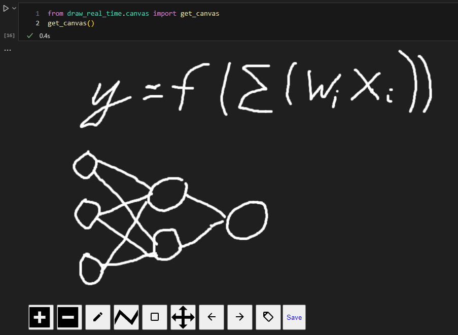

# DrawRealTime

### This is a library foundation on `dash_canvas` to easy create canvas in jupyter cells

## Install

```
pip install draw-real-time
```

## Usage

```python
from draw_real_time.canvas import get_canvas
get_canvas()
```

## Example


